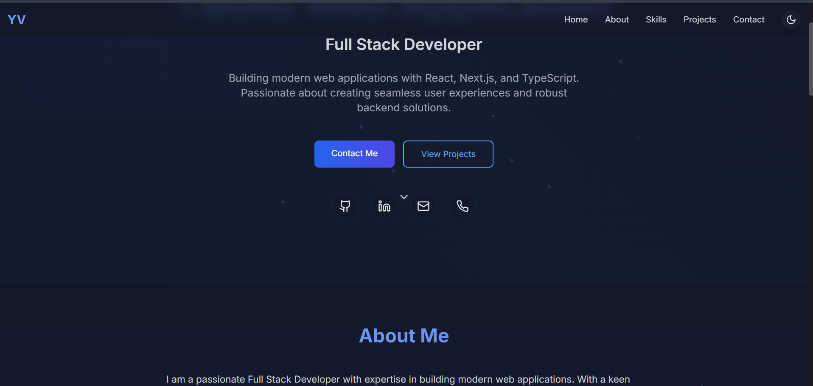

# Yagnik Vadaliya - Portfolio

A modern, responsive portfolio website built with Next.js, TypeScript, Tailwind CSS, and Framer Motion.



## 🌟 Features

- **Modern Design**: Clean and professional interface with smooth animations
- **Responsive**: Fully responsive design that works on all devices
- **Dark Mode**: Automatic and manual dark mode support
- **Animations**: Beautiful animations and transitions using Framer Motion
- **Custom Cursor**: Interactive custom cursor with hover effects
- **Performance**: Optimized for performance and SEO
- **Type Safety**: Built with TypeScript for better development experience

## 🚀 Tech Stack

- **Framework**: [Next.js 14](https://nextjs.org/)
- **Language**: [TypeScript](https://www.typescriptlang.org/)
- **Styling**: [Tailwind CSS](https://tailwindcss.com/)
- **Animations**: [Framer Motion](https://www.framer.com/motion/)
- **Icons**: [Lucide Icons](https://lucide.dev/)
- **Deployment**: [Vercel](https://vercel.com/)

## 🛠️ Installation & Set Up

1. Clone the repository

```bash
git clone https://github.com/yourusername/portfolio.git
```

2. Install dependencies

```bash
npm install
```

3. Run the development server

```bash
npm run dev
```

4. Build for production

```bash
npm run build
```

## 🌐 Environment Variables

Create a `.env.local` file in the root directory and add the following variables:

```env
NEXT_PUBLIC_SITE_URL=your-site-url
```

## 📁 Project Structure

```
├── public/             # Static files
├── src/
│   ├── app/           # Next.js app directory
│   ├── components/    # React components
│   ├── contexts/      # React contexts
│   ├── lib/          # Utility functions
│   └── styles/       # Global styles
├── tailwind.config.js # Tailwind CSS configuration
└── tsconfig.json     # TypeScript configuration
```

## 🔄 CI/CD

This project uses GitHub Actions and Vercel for CI/CD:
- Automatic deployments on push to main branch
- Preview deployments for pull requests
- Automated testing and linting checks

## 📝 License

This project is licensed under the MIT License - see the [LICENSE](LICENSE) file for details.

## 🤝 Contact

Yagnik Vadaliya - [vadaliyayagnik06@gmail.com](mailto:vadaliyayagnik06@gmail.com)

Project Link: [https://github.com/yourusername/portfolio](https://github.com/yourusername/portfolio)
